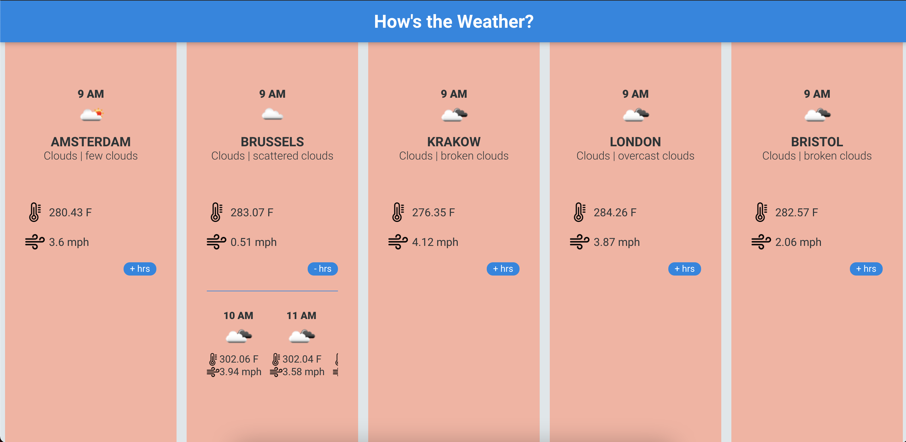

<p align="left">
   
</p>

# How's the weather?

> Check it out the current and the next 24 hours weather of 5 European cities!

[](https://github.com/jennifertakagi)
[](#)
[](https://github.com/jennifertakagi/weather-app/stargazers)
[](https://github.com/jennifertakagi/weather-app/network/members)
[](https://github.com/jennifertakagi/weather-app/graphs/contributors)

---

# :pushpin: Table of Contents

* [Features](#rocket-features)
* [UI Documentation](#framed_picture-ui-documentation)
* [Installation](#construction_worker-installation)
* [Getting Started](#runner-getting-started)
* [FAQ](#postbox-faq)
* [Found a bug? Missing a specific feature?](#bug-issues)
* [Contributing](#tada-contributing)
* [License](#closed_book-license)

<br />

# :rocket: Features

* Gets all data from a public API: https://openweathermap.org
* Shows the weather of Amsterdam, Bristol, Brussels, London and Krakow
* Shows the current weather of each city, with the information about: city's name, main weather, weather description, average temperature, wind speed and the current hour
* Shows the next 24 hours at a click

# :framed_picture: UI Documentation
This project has a UI Documentation of reusable components, allowing to test them individually.

* Desktop version
<p align="left">
   
</p>

* Mobile version
<p align="left">
   
</p>

# :construction_worker: Installation

**You need to install [NPM](https://www.npmjs.com/) or  [YARN](https://yarnpkg.com/) first, then in order to clone the project via HTTPS, run this command:**

```git clone https://github.com/jennifertakagi/weather-app.git```

SSH URLs provide access to a Git repository via SSH, a secure protocol. If you have a SSH key registered in your Github account, clone the project using this command:

```git clone git@github.com:jennifertakagi/weather-app.git```

**Install dependencies**

You need to install the dependencies of the project, so **run the above command on root**:

```yarn | npm i```

# :runner: Getting Started

Run the following command in root folder to start (on port 4200) the application in a development environment:

```yarn start```

# :octopus: Running tests

Run the following command in root folder to run all the unit tests on the application:

```yarn test | test:coverage```

# :postbox: Faq

**Question:** What are the technologies used in this project?

**Answer:** The technologies used in this project are [Angular](https://angular.io/), [TypeScript](https://www.typescriptlang.org/), [RXJS](https://rxjs-dev.firebaseapp.com/), [Karma](https://karma-runner.github.io/) and [Jasmine](https://jasmine.github.io/).

**Question:** What's the project tests coverage?

**Answer:** In the first version it has 82,8% of unit tests coverage.
<p align="left">
   
</p>

# :dart: Ideas to version 2.0

The project plan to the next version includes:
- To be able to search a city weather by an input 🚀

* Technical improvements
- To increase the unit test coverage to 100% 🚀
- To add E2E test 🚀
- To create an own carousel component and remove this dependency

# :bug: Issues

Feel free to **file a new issue** with a respective title and description on the [How's the weather?](https://github.com/jennifertakagi/weather-app/issues) repository. If you already found a solution to your problem, **i would love to review your pull request**! Have a look at our [contribution guidelines](https://github.com/jennifertakagi/weather-app/blob/master/CONTRIBUTING.md) to find out about the coding standards.

# :closed_book: License

Released in 2021.
This project is under the [MIT license](https://github.com/jennifertakagi/weather-app/master/LICENSE).
